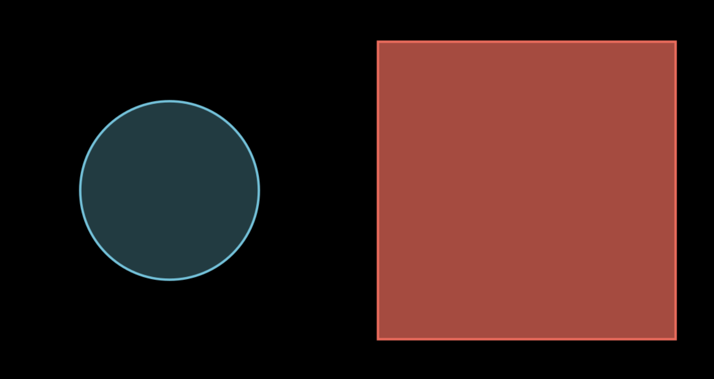

# Activity 08 - Exploring Python Modules Through Mathematical Animation! 🎬✨

CMPSC101 :: Fall 2025

**Assigned**: 7th November 2025
**Due and Expiration date**: 7th November 2025 End of class (Cut off due date and time).



## Welcome to Online Mathematical Animation! 🌐

Ready to bring math to life **without any installation headaches**? Today you will discover the power of Python modules by creating stunning mathematical animations using **Manim** (Mathematical Animation Engine) - all running in your web browser! 🎥

This notebook-based approach eliminates all software installation issues. Instead of spending class time troubleshooting installations, you will jump straight into learning about **modules** - one of Python's most powerful features for organizing and reusing code! 🧰

## What Are Python Modules? 🐍

### The Module Ecosystem

**Built-in Modules**: Come with Python (like `math`, `random`, `datetime`)

```python
import math
print(math.pi)  # 3.141592653589793
```

**Third-party Modules**: Created by the community (like `manim`, `numpy`, `matplotlib`)

```python
from manim import *
circle = Circle()  # Create a perfect circle for animation!
```

**Your Own Modules**: Files you create and import

```python
from my_shapes import custom_triangle
```

### Like, Why Do Modules Matter?

- **Code Reusability**: Write once, use everywhere
- **Organization**: Keep related functions together
- **Collaboration**: Use others' expertise
- **Efficiency**: Don't reinvent the wheel!

## Meet Online Manim! 🚀

### What is Manim?

**Manim** (Mathematical Animation Engine) is a Python library created by Grant Sanderson (3Blue1Brown) for creating precise mathematical animations. It's like having a professional animation studio for math concepts!

**What can you create?**

- Geometric transformations 📐
- Function plots that draw themselves 📊
- Text that appears with style ✍️
- Complex mathematical visualizations 🌊

## Your Mission: Two Animation Adventures! 🎯

There are two parts to this activity, each focusing on different aspects of Python modules through Manim animations.

- Part 1: `tutorial_01_notebook.md`
- Part 2: `tutorial_02_notebook.md`

### Part 1: Geometric Masterpiece (Tutorial 1)

**Tutorial guide**: `tutorial_01_notebook.md`

Create beautiful geometric shapes and learn module basics:

- Import and understand Manim modules
- Create circles, squares, triangles
- Apply colors and transformations
- Understand the Scene class structure
- Static scene composition with `self.add()`

### Part 2: Dynamic Animations (Tutorial 2)

**Notebook to create**: Tutorial 2 cells in your Jupyter notebook  
**Tutorial guide**: `tutorial_02_notebook.md`

Bring your creations to life with advanced module integration:
- Animation classes (`Create`, `Transform`, `FadeIn`)
- The `self.play()` method for timing
- Mathematical plotting with NumPy integration
- Complex animation sequences and coordination
- External module integration

## Getting Started: Access the Online Environment 🌐

### Step 1: Open the Online Manim Jupyter Environment

**Click this link to access the online environment:**
- **Main Environment**: https://www.manim.community/
  - Click on: *Try Manim Online*

**What you will see:**

- A file browser with example notebooks
- A "New" button to create notebooks
- Examples from the Manim community

### Step 2: Create Your Activity Notebook

1. **Click "New"** → **"Python 3"** to create a new notebook
2. **Rename your notebook** to "Activity_08_Animation_Magic" (click on "Untitled" at the top)
3. **You're ready to start!** The environment comes with Manim pre-installed

### Step 3: Follow the Notebook Interface Basic

Follow the tutorials to have some fun while creating your animations using Jupyter notebooks!

**Important URLs to Bookmark:**

- **Main Environment**: https://www.manim.community/
  - Click on: *Try Manim Online*
- **Manim Documentation**: https://docs.manim.community/
- **Manim Documentation**: https://docs.manim.community/en/stable/

---

## Project Assessment

This is a checkmark assignment.

## 📋 Assignment Deliverables 📝

You are to submit the following items to your GitHub repository for this activity:

1. **Downloaded notebook file** (`src/Activity_08_Animation_Magic.ipynb`) containing all your tutorial work with properly formatted cells
2. **Completed reflection document** (`writing/reflection.md`) with analysis of module concepts

---

## Submission

🚀 As you work on your lab, commit and push regularly using these commands:

```bash
git add -A
git commit -m "Your descriptive commit message here"
git push
```

**Important**: After pushing, visit your GitHub repository in a browser to verify your files uploaded correctly!

## Seeking Assistance

Students with questions are encouraged to:
- Ask in the course Discord channel
- Attend instructor or TL office hours  
- Collaborate appropriately while maintaining academic integrity

Remember: Learning to debug and solve problems independently is a crucial skill, but do not hesitate to seek help when needed!

(Sorry this readme document was so long... There was just a lot to cover!)
